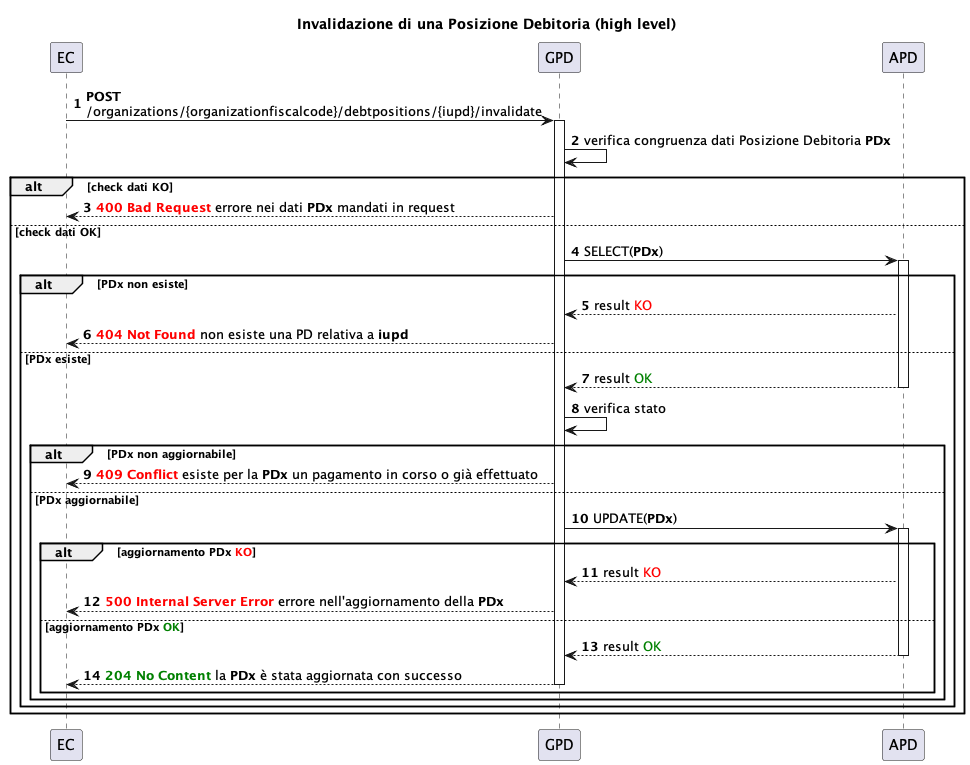
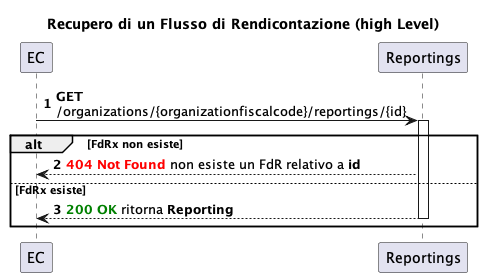

# Operazioni disponibili


Tutte le operazioni indicate sono segregate per codice fiscale dell'ente creditore (`organizationfiscalcode`).

In caso di intermediazione, è possibile associare alla _subscription key_ dell'intermediario da _1_ ad _n_ codici fiscali di enti intermediati, ciò consente agli intermediari di utilizzare una sola _subscription key_ per l'invocazione delle API per conto di tutti gli enti intermediati. Tali abilitazioni devono essere richieste a PagoPA contestualmente alla creazione della _subscription key_ o in momenti successivi.&#x20;

Le _subscription key_ e le relative abilitazioni sono segregate per ambiente _UAT/PROD._


## Gestione posizioni debitorie

Nei seguenti sequence diagram si identifica con l'acronimo GPD il servizio di Gestione Posizioni Debitorie e con APD l'Archivio delle Posizioni Debitorie (base dati).

Per i dettagli [https://github.com/pagopa/pagopa-api/tree/SANP3.8.0/openapi](https://github.com/pagopa/pagopa-api/tree/SANP3.8.0/openapi)

### Creazione di una posizione debitoria


[https://raw.githubusercontent.com/pagopa/pagopa-api/SANP3.7.1/openapi/gpd.json](https://raw.githubusercontent.com/pagopa/pagopa-api/SANP3.7.1/openapi/gpd.json)


.png>)

In fase di creazione della posizione debitoria il servizio effettuerà controlli sui dati in input e controlli di eventuali duplicati.

Tra i controlli dei dati in input si rilevano:

* obbligatorietà dei dati
* coerenza date (ad esempio `due_date` ≥ `validity_date)`
* coerenza importi (ad esempio la somma degli importi dei versamenti deve essere uguale all'importo totale)
* validità della tassonomia
* validità degli IBAN (devono essere censiti sulla piattaforma pagoPA)

Tra i controlli dei duplicati ci si basa sugli identificativi di pagamento (IUPD, IUV e fiscalCode)

Il _query parameter_ `toPublish` consente di pubblicare automaticamente una posizione debitoria in fase di creazione, impostando questo parametro a `true` e valorizzando contestualmente a `null` il campo `validityDate`, la posizione debitoria andrà direttamente nello stato VALID pronta per essere pagata.

### Lettura di una lista di  posizioni debitorie e di una singola posizione debitoria


[https://raw.githubusercontent.com/pagopa/pagopa-api/SANP3.7.1/openapi/gpd.json](https://raw.githubusercontent.com/pagopa/pagopa-api/SANP3.7.1/openapi/gpd.json)


.png>)

La lettura di una lista di posizioni debitorie prevede sempre una paginazione. E' inoltre possibile filtrare per `due_date` in modo da limitare i risultati.


[https://raw.githubusercontent.com/pagopa/pagopa-api/SANP3.7.1/openapi/gpd.json](https://raw.githubusercontent.com/pagopa/pagopa-api/SANP3.7.1/openapi/gpd.json)


.png>)

La lettura di una posizione debitoria si basa sull'identificativo in input (IUPD). In caso lo IUPD non sia esistente verrà emesso un errore.

### Aggiornamento di una posizione debitoria


[https://raw.githubusercontent.com/pagopa/pagopa-api/SANP3.7.1/openapi/gpd.json](https://raw.githubusercontent.com/pagopa/pagopa-api/SANP3.7.1/openapi/gpd.json)


.png>)

In fase di aggiornamento, oltre ai già citati controlli in fase di creazione , si verifica che la posizione sia esistente ed aggiornabile.

In particolare l'aggiornabilità della posizione debitoria dipende dallo stato della posizione stessa (ad esempio se una posizione è già stata pagata non sarà possibile aggiornarla)


E' importante porre particolare attenzione al campo `notificationFee` che contiene le spese di notifica della posizione debitoria. Questo campo viene gestito in modo esclusivo da Piattaforma Notifiche e l'eventuale importo viene aggiunto automaticamente dal sistema GPD all'importo delle posizioni debitorie. \
L'EC pertanto in fase di aggiornamento dell'importo `amount` di uno dei `transfer` presenti all'interno di una `paymentOption`, non dovrà tenere conto del valore presente all'interno del campo `notificationFee`.


### Cancellazione di una Posizione Debitoria


[https://raw.githubusercontent.com/pagopa/pagopa-api/SANP3.4.1/openapi/gpd.yaml](https://raw.githubusercontent.com/pagopa/pagopa-api/SANP3.4.1/openapi/gpd.yaml)


.png>)

La cancellazione di una posizione debitoria prevede controlli sia sull'esistenza (IUPD) che sullo stato (ad esempio, una posizione debitoria non sarà cancellabile se è già stata pagata)

### Pubblicazione di una posizione debitoria


[gpd_core.json](../../.gitbook/assets/gpd_core.json)


.png>)

La pubblicazione della posizione debitoria permette il passaggio dallo stato `DRAFT` allo stato `PUBLISHED.`&#x20;

Una posizione in stato `DRAFT` (bozza) infatti non permette la normale operatività con la piattaforma pagoPA. Solo quando l'Ente Creditore pubblica la posizione, in coerenza con le date di validità e di scadenza, questa risulta pagabile sulla piattaforma.

### Invalidazione di una posizione debitoria


[gpd_core.json](../../.gitbook/assets/gpd_core.json)


L'invalidazione di una posizione debitore consiste di fatto in una cancellazione logica. E' possibile solo partendo dagli stati `PUBLISHED` e `VALID`.

La funzionalità è utile quando si vuole dare evidenza all'utente, in fase di pagamento, della invalidazione della posizione debitoria.

## Ricevute di pagamento

Sono messe a disposizione due API per il recupero delle ricevute di pagamento:

* lista ricevute di pagamento
* dettaglio singola ricevuta


[https://raw.githubusercontent.com/pagopa/pagopa-api/SANP3.7.0/openapi/gpd_payments.json](https://raw.githubusercontent.com/pagopa/pagopa-api/SANP3.7.0/openapi/gpd_payments.json)


<figure><figcaption></figcaption></figure>


[https://raw.githubusercontent.com/pagopa/pagopa-api/SANP3.7.0/openapi/gpd_payments.json](https://raw.githubusercontent.com/pagopa/pagopa-api/SANP3.7.0/openapi/gpd_payments.json)


<figure><figcaption></figcaption></figure>

## Flussi di rendicontazione

Sono messe a disposizione delle funzionalità di lettura dei flussi di rendicontazione:

* Lista di flussi di rendicontazione per un Ente Creditore
* Dettaglio del flusso di rendicontazione


L'abilitazione al servizio per la gestione dei flussi di rendicontazione su GPD non è automatico e va richiesto esplicitamente al momento dell'on-boarding dell'EC



[gpd_fdr.yaml](../../.gitbook/assets/gpd_fdr.yaml)



[gpd_fdr.yaml](../../.gitbook/assets/gpd_fdr.yaml)


