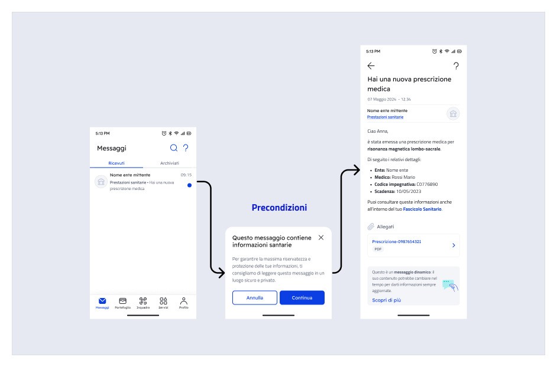

# Send a message with remote content

### What are messages with remote content?

Messages with remote content respond to the need to send **communications containing personal data and/or sensitive data** via IO to citizens, guaranteeing their management in compliance with privacy regulations. In fact, by selecting this sending method **the information is not stored on IO**, but retrieved from your system each time the user accesses the message in app. 

For a message, remote contents are:

* subject;
* body;
* opening preconditions (optional, e.g.: disclaimer);
* attachments (Premium).

### What changes?

#### 📐 Architecture

Unlike traditional sending, where the content of the message is transmitted to the IO systems as soon as it is created, with remote messages these **contents reside only on your systems** and IO retrieves them each time that the recipient user wants to view them in app.

<figure><figcaption><p>Sequence of the main phases in the two sending scenarios</p></figcaption></figure>

In this way, IO acts as a **real-time communication** channel between you and your user and keeps only the information necessary for retrieving the message and check its status.

 Managing remote messages implies that your organization is responsible for the contents sent via IO, with particular reference to their i**accuracy** and **availability** to the user. 

#### 🕵️‍♂️ Management of sensitive information

As specified, remote messages are meant for guaranteeing the _privacy compliant_ sending of personal/sensitive information related to the recipient, **if necessary for providing the service.** 

 Remember that this sending method **does not change your obligations pursuant to current regulations**, in particular pursuant to art. 7.3 of the [IO guidelines](https://trasparenza.agid.gov.it/moduli/downloadFile.php?file=oggetto_allegati/213121604430O__OLG+Punto+accesso+telematico+servizi+PA_3.11.2021.pdf). 

As an additional privacy protection measure, the flag [#require_secure_channels](../../api-and-specifications/api-messages/submit-a-message-passing-the-user-tax-code-in-the-request-body.md#require_secure_channels "mention") allows your to **mark a message as containing sensitive information**, with the following effects:

* push notifications on the devices of the recipient will show a generic invitation to open the message, without showing the content of the subject;
* the messages will not be forwarded via email regardless of the preference set by the recipient user.

 You can also set the flag `require_secure_channels` [directly in the service](../publish-a-service/mandatory data/attributes.md#require_secure_channels), so you don't have to do it for each single message. 

#### ✏️ Updating contents over time

Unlike traditional messages, remote content messages can be changed **also after they are sent**: you can, for example, correct a typo or dynamically update information that is no longer valid or is misleading (e.g.: after canceling an appointment). 

When considering this option, keep in mind that:

* The recipient user **will not receive any notification** if the content of a previously received message is updated. In fact, the content can be updated by retrieving it from your systems only when and if the user opens the message in app;
* The sending institution remains responsible for the information sent via IO.

 In principle, if the context that produced a message changes or new information must be transmitted, it is always preferable to **send a new message** to inform the recipient.

In the case of doubts, it is always preferable to maintain the **coherence of information** for your users: the messages on IO are an important calling card for your organization, [ensuring the quality](https://docs.pagopa.it/manuale-servizi/comunicare-un-servizio/i-canali)!  

<details>

<summary>User case for booking an appointment - Example of updating the contents of a message after sending it</summary>

1. Your institution sends the recipient citizen a message with remote content to confirm the appointment booked for a health service:
2. The recipient reads the message and decides to cancel the appointment using the channels you provided for managing appointments;
3. Your institution sends the user a **new message** to confirm the cancellation;
4. To ensure the coherence of the information, the institution **updates the contents of the first message**, replacing and/or deleting the information confirming the appointment and the obsolete references.

</details>

To make the recipient aware of the fact that the contents could have been updated over time, the following notification was included at the bottom of the details of your messages with remote content, in a brief and extended form:

<figure><figcaption><p>Brief notice at the end of the message</p></figcaption></figure>

<figure><figcaption><p>Extended notice, which can be consulted via the CTA &quot;Discover more&quot;</p></figcaption></figure>

 **IO does not check** if the contents of a message with remote content are not changed over time. The accuracy and availability of the information contained in the message are the exclusive responsibility of the sending institution. 

 As the data controller, you must directly guarantee to the users that they can exercise the rights of data subjects pursuant to GDPR, and that every request of that type will be redirected to you. For example, the right of access pursuant to art. 15 GDPR must be guaranteed to the data subjects who make the request, also using the contact information on the service tab. 

### How is a remote content message sent?

 Before sending messages with remote content it is necessary to follow the procedure illustrated in [remote-configuration.md](../../initial-setup/remote-configuration.md "mention") 

The life cycle of a message with remote content is made of up two main phases:

* The **sending** (creation) by the systems of your organization;
* The **use** (display) by the recipient.

<figure><figcaption><p>The two main phases of the life cycle of a message with remote content</p></figcaption></figure>

Both phases require an integration between your systems and the IO systems.

### Message sending phase

#### Creation of the message with remote content

During this phase, your systems integrated with IO request the creation (and therefore the sending) of a new message to a specific recipient. For more information about sending a message on IO, refer to [.](./ "mention").

The following table summarizes the main remote components of an IO message:

<table><thead><tr><th width="197">Component</th><th>Flag to set</th><th>Notes</th><th data-hidden data-type="checkbox">Can be remote?</th></tr></thead><tbody><tr><td>preconditions</td><td><a data-mention href="../../api-and-specifications/api-messages/submit-a-message-passing-the-user-tax-code-in-the-request-body.md#has_precondition">#has_precondition</a></td><td>This is <em>optional</em>information that is displayed <em>before opening the details of the message</em>.</td><td>false</td></tr><tr><td>Subject</td><td><a data-mention href="../../api-and-specifications/api-messages/submit-a-message-passing-the-user-tax-code-in-the-request-body.md#has_remote_content">#has_remote_content</a></td><td>This is the subject that is visible <em>when opening the message</em>, which differs from what is shown on the message list (not remote).</td><td>true</td></tr><tr><td>body (markdown)</td><td><a data-mention href="../../api-and-specifications/api-messages/submit-a-message-passing-the-user-tax-code-in-the-request-body.md#has_remote_content">#has_remote_content</a></td><td>This is the text content of the message.</td><td>true</td></tr><tr><td>details of a payment notice</td><td></td><td>They are already remote thanks to the integration with the pagoPA node.</td><td>true</td></tr><tr><td>attachments (PDF)</td><td><a data-mention href="../../api-and-specifications/api-messages/submit-a-message-passing-the-user-tax-code-in-the-request-body.md#has_attachments">#has_attachments</a></td><td>These are contents that can only be managed remotely. You can include them if you have signed a Premium agreement. The accepted format is PDF.</td><td>true</td></tr></tbody></table>

<details>

<summary>Important information regarding preconditions when opening the message</summary>

As the sending institution, you can decide that the opening of the message must be preceded by targeted content that informs the recipient about particular aspects or circumstances regarding the message itself.

The preconditions are an intermediate screen between the list of messages and the details of the selected message. The user accesses the message details only after pressing the "Continue” button. 



In fact, the display of the preconditions **interrupts the reading flow of a message**. Therefore, they should be used only in cases in which they add value to your communication or are otherwise required by current regulations, in order not to degrade the user experience.

**When to use them:**  
When it is necessary to draw the citizen's attention to fundamental information, and in any case if required by application regulations, for example for legally binding communications, for which opening the message has legal effects for the citizen.

**When not to use them:**   
To transmit notifications that are not strictly correlated to the message content or to add detailed information that can be provided in the message, or in other moments of the user experience.

</details>

<details>

<summary>Important information about the title (subject) of the message in relation to the flag &quot;has_remote_content&quot;</summary>

The subject of the message is used by the IO app for three reasons:

1. as the subject visible on the list of received messages;
2. as a header in the message details, once opened;
3. in the text of the push notifications connected to the message (if enabled by the user and if the message/service are not marked by you as containing sensitive information)

Depending on the value of the flag [#has_remote_content](../../api-and-specifications/api-messages/submit-a-message-passing-the-user-tax-code-in-the-request-body.md#has_remote_content "mention") that you will specify in [#third_party_data](../../api-and-specifications/api-messages/submit-a-message-passing-the-user-tax-code-in-the-request-body.md#third_party_data "mention") (see further on in this chapter) the **subject of the message** will behave differently:

* if [#has_remote_content](../../api-and-specifications/api-messages/submit-a-message-passing-the-user-tax-code-in-the-request-body.md#has_remote_content "mention")`=true`, the [#subject](../../api-and-specifications/api-messages/submit-a-message-passing-the-user-tax-code-in-the-request-body.md#subject "mention") field indicated when the message is created is used by IO in the list of the messages received, as text of the push notification and as the subject of any email sent forwarding the message, but not in the detail view of the message in app: this, on the other hand, is retrieved subsequently (see [#what-happens-when-the-recipient-opens-a-remote-message](send-a-message-remote-content.md#cosa-succede-quando-il-destinatario-apre-un-messaggio-remotizzato "mention")).  
  
**This means that the recipient may see different texts in the message detail and outside**. We recommend not changing the subject significantly, in order to maintain the coherence of the information between the two texts. Also remember that pursuant to the IO guidelines, it is not possible to include sensitive information in the subject of the message.

<!---->

* if [#has_remote_content](../../api-and-specifications/api-messages/submit-a-message-passing-the-user-tax-code-in-the-request-body.md#has_remote_content "mention")`=false` or if you do not include the flag, the [#subject](../../api-and-specifications/api-messages/submit-a-message-passing-the-user-tax-code-in-the-request-body.md#subject "mention") field will have the standard function of a traditional (not remote) message: the same text content is used in the message details and in all the other contexts mentioned above.

</details>

<details>

<summary>Important information about the body (markdown) of the message</summary>

During the phase of creating a message with remote content ( [#has_remote_content](../../api-and-specifications/api-messages/submit-a-message-passing-the-user-tax-code-in-the-request-body.md#has_remote_content "mention")`=true`), it is still necessary, in compliance with the IO API interface, to define a **“courtesy” non-remote text (markdown)**, which will be used to create the email that forwards the message that IO users can select to receive when they are delivered a message in app.

**Markdown limits for the purpose of forwarding:** min 80, max 134 characters, beyond which the system cuts it off with an ellipsis.

**Note about message forwarding via email:** If enabled by the end user, a message sent via IO can be forwarded to their email address. The email contains the incipit of the body of the message (the first 134 characters), as well as an invitation to open the app to access the complete content via CTA, which permits the redirect. Here is an example of a forwarding email:

.png)

</details>

 **Note about the attachments (Premium)**  
If you have signed a Premium Agreement, your messages can also include **attachments** in PDF format: also they will be sent directly by your systems to the app when the recipient opens the message. For more information, refer to [add-attachments.md](add-attachments.md "mention") 

For messages with remote content, it is _mandatory_ to enter the following additional information in the block [#third\_party\_data](../../api-and-specifications/api-messages/submit-a-message-passing-the-user-tax-code-in-the-request-body.md#third_party_data "mention"):

<table><thead><tr><th width="237">Field</th><th>Field description</th></tr></thead><tbody><tr><td><a data-mention href="../../api-and-specifications/api-messages/submit-a-message-passing-the-user-tax-code-in-the-request-body.md#id">#id</a></td><td>This is the <strong>remote correlation identifier</strong>, which uniquely identifies a specific message directed to a specific recipient. This identifier, <strong>determined by you</strong>, consists of a string that <strong>allows the API</strong>to retrieve the remote content for that specific message.</td></tr><tr><td><a data-mention href="../../api-and-specifications/api-messages/submit-a-message-passing-the-user-tax-code-in-the-request-body.md#configuration_id">#configuration_id</a></td><td>Indicate in this field the identifier you received in the  <a data-mention href="../../initial-setup/remote-configuration.md">remote-configuration.md</a>phase: IO will use this data to determine the set of information required to retrieve the REST <em>endpoints</em> provided by your organization that will serve the remote data for this message.</td></tr><tr><td><a data-mention href="../../api-and-specifications/api-messages/submit-a-message-passing-the-user-tax-code-in-the-request-body.md#has_precondition">#has_precondition</a></td><td><p>Set this field only if you want for the recipient to be shown a text (with the subject) when opening the message in app that contains <strong>context information</strong> that you will indicate at the moment (for more information refer to <a data-mention href="../../api-and-specifications/openapi-recovery-endpoint-of-remote-content.md#endpoint-di-recupero-delle-precondizioni-allapertura-del-messaggio">#retrieval-endpoint-of-preconditions-when-opening-the-message</a>): once the text is read, <strong>the recipient can select whether to continue opening the message</strong> or return to the list of received messages; the possible values for this field are:</p><ul><li><code>NEVER</code> (default)</li><li><code>ONCE</code> (the preconditions are shown only the first time the recipient tries to open the message)</li><li><code>ALWAYS</code> (the preconditions are shown every time, even if the message was previously read)</li></ul></td></tr><tr><td><a data-mention href="../../api-and-specifications/api-messages/submit-a-message-passing-the-user-tax-code-in-the-request-body.md#has_remote_content">#has_remote_content</a></td><td>Set the field to <code>true</code> <strong>if you want the title (subject) and the body of the message to be remote content</strong>; when IO requests them from you via the API that you have provided, you must respond with a text string for the subject and a <em>markdown</em> for the body, as if you had specified them at the moment of creating a traditional message; the default setting for this field is <code>false</code>.<br>For more information and to understand the role of the subject in a message with remote content, refer to <a data-mention href="../../api-and-specifications/openapi-recovery-endpoint-of-remote-content.md#endpoint-di-recupero-dei-dettagli-del-messaggio">#retrieval-endpoint-of-message-details</a></td></tr><tr><td><a data-mention href="../../api-and-specifications/api-messages/submit-a-message-passing-the-user-tax-code-in-the-request-body.md#has_attachments">#has_attachments</a></td><td>Set the field to <code>true</code> if you want to <strong>attach one or more documents in PDF format to the message</strong>: as shown in <a data-mention href="../../api-and-specifications/openapi-recovery-endpoint-of-remote-content.md#endpoint-di-recupero-dei-dettagli-del-messaggio">#retrieval-endpoint-of-message-details</a>, when IO requests the details of the message from you, you must indicate the metadata for the attachments (name and relative URL); when the recipient will select an attachment in app, IO will retrieve the bytes from your systems, via the API described in <a data-mention href="../../api-and-specifications/openapi-recovery-endpoint-of-remote-content.md#endpoint-di-recupero-dei-byte-del-singolo-allegato">#retrieval-endpoint-of-the-bytes-of-the-single-attachment</a>.<br>Remember that you can only set this flag if the institution has signed the IO Premium Agreement.</td></tr></tbody></table>

 Whether or not it is remote, if the message contains **sensitive information**, you _must always_ set the flag [#require\_secure\_channels](../../api-and-specifications/api-messages/submit-a-message-passing-the-user-tax-code-in-the-request-body.md#require_secure_channels "mention")`=true` 

### Message usage phase

#### What happens when the recipient opens a message with remote content?

At this stage, IO uses the flags that you had indicated at the creation stage to determine how to compose the message in app, and then proceeds to retrieve any remote data and integrate them with those already in its possession to present the final result to the recipient.

 Each call by IO to your systems is identified by the remote correlation [#id](../../api-and-specifications/api-messages/submit-a-message-passing-the-user-tax-code-in-the-request-body.md#id "mention") that you indicated during the [#creation of-the-remote-message](send-a-message-remote-content.md#creazione-del-messaggio-remotizzato "mention") and, as a _header_, the [#fiscal\_code](../../api-and-specifications/api-messages/submit-a-message-passing-the-user-tax-code-in-the-request-body.md#fiscal_code "mention") of the recipient. 

In particular, if during the [#creation-of-the-remote-message](send-a-message-remote-content.md#creazione-del-messaggio-remotizzato "mention") phase you had indicated [#has_precondition](../../api-and-specifications/api-messages/submit-a-message-passing-the-user-tax-code-in-the-request-body.md#has_precondition "mention") with value `ONCE` or `ALWAYS`, as soon as the recipient selects the message from the list of messages in app not having already read it  (`=ONCE`) or every time (`=ALWAYS`) , IO will retrieve the endpoint to be called from the configuration information, and will **invoke your systems** to **obtain the subject or text of the message as the response** to be shown on the pop-up panel of the [#preconditions-for-opening](send-a-message-remote-content.md#precondizioni-allapertura "mention").

Following the API call to [#retrieval-endpoint-of-preconditions-when-opening-the-message](../../api-and-specifications/openapi-recovery-endpoint-of-remote-content.md#endpoint-di-recupero-delle-precondizioni-allapertura-del-messaggio "mention") you must respond as shown in the example:


```json
{
    "title": "This is the title of the preconditions",
    "markdown": "This is the text of the preconditions in **markdown** format"
}
```


The preconditions panel has two buttons: “Cancel” and “Continue”.

If the recipient selects "**Continue**", IO will proceed with displaying the message in app; otherwise the user will be returned to the list of messages.

If during the [#creation of the remote message](send-a-message-remote-content.md#creazione-del-messaggio-remotizzato "mention") you indicated [#has_remote_content](../../api-and-specifications/api-messages/submit-a-message-passing-the-user-tax-code-in-the-request-body.md#has_remote_content "mention")`=true`, the title and body of the message will be retrieved at the moment it is opened via a call that IO will make to the API you provided (for details refer to [#recovery-endpoint-of-message-details](../../api-and-specifications/openapi-recovery-endpoint-of-remote-content.md#endpoint-di-recupero-dei-dettagli-del-messaggio "mention")).

 As for the traditional model, you can add a due date also for the message with remote content ([#due_date](../../api-and-specifications/api-messages/submit-a-message-passing-the-user-tax-code-in-the-request-body.md#due_date "mention")) and the data related to the amount that is due ([#payment_data](../../api-and-specifications/api-messages/submit-a-message-passing-the-user-tax-code-in-the-request-body.md#payment_data "mention")); this information is already remote content thanks to the integration with the pagoPA node. 

### 