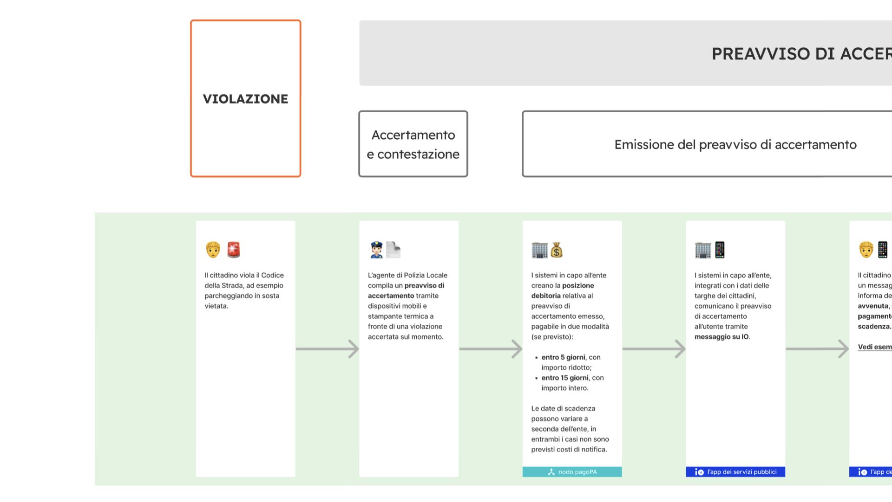

# Generazione dell’Identificativo Univoco di Versamento

Secondo quanto definito nel [paragrafo 7.1 delle Linee Guida](https://www.gazzettaufficiale.it/eli/id/2018/07/03/18A04494/sg) la generazione di un codice IUV che risulti **univoco** nel corso del tempo è una responsabilità in capo all'EC, che è libero di strutturarne la composizione secondo le proprie esigenze, facendo attenzione che tale codifica sia conforme agli standard internazionali esistenti e tenga conto del numero dei “punti di generazione” del codice stesso ([Punti di generazione del codice IUV](generazione-dellidentificativo-univoco-di-versamento.md#punti-di-generazione-del-codice-iuv)).

## **Punti di generazione del codice IUV**

Il sistema pagoPA consente ad un EC di utilizzare uno più intermediari e/o partner tecnologici: tale circostanza fa sì che la generazione dello IUV possa avvenire in maniera indipendente presso più soggetti e possibilmente non sotto il controllo diretto dell’EC.

Tale situazione può essere presente anche presso EC dotati di un'organizzazione complessa e articolata in più unità organizzative autonome, che hanno la necessità di generare il codice IUV in maniera indipendente.

Si definisce quindi "punto di generazione del codice IUV" qualsiasi entità, facente parte o meno dell'organizzazione dell'EC, incaricata da questo di associare un codice IUV ad un unico pagamento presente nell'archivio dei pagamenti in attesa di cui al [paragrafo 7 delle Linee Guida](https://www.gazzettaufficiale.it/eli/id/2018/07/03/18A04494/sg).

PagoPA S.p.A. attribuirà uno o più codici di segregazione (progressivamente a salire: da 00 a 45) ad ognuno degli intermediari/partner tecnologici, ovvero entità autonome dell'EC, secondo quanto da questi richiesto.

Se un EC genera in proprio attraverso entità autonome il codice IUV e si avvale contemporaneamente di un intermediario o di un partner tecnologico, le entità autonome dovranno essere censite alla stregua di intermediario/partner dello stesso ente.

## **Il codice di segregazione**

Tutto ciò premesso, è necessario definire delle regole affinché la codifica del pagamento risulti effettivamente univoca all'interno dell'EC nel corso del tempo: questo risultato si ottiene associando ad ogni punto di generazione del codice IUV un particolare codice che serve a segregare i domini di gestione dei pagamenti dell'ente.

Tale codice viene denominato "codice di segregazione".

PagoPA S.p.A. attribuisce il codice di segregazione ad ogni punto di generazione del codice IUV in funzione del soggetto che svolge il ruolo di intermediario o partner tecnologico, secondo la seguente classificazione:

1. **Erogatori di servizi centralizzati**: intermediari tecnologici, che erogano servizi in modalità accentrata a livello nazionale;
2. **Punti di generazione del codice IUV**: qualsiasi intermediario o partner tecnologico che non rientra nella classificazione precedente, nonché le unità autonome dell'ente.

Uno schema delle modalità di attribuzione del Codice Segregazione è riportata in Figura 1.

### **Erogatori di servizi centralizzati**

Sono quei soggetti, censiti a livello generale, che erogano servizi centralizzati per una comunità di EC con riferimento a procedure specifiche: quali, ad esempio, il SUAP, l'emissione on-line della Carta di Identità Elettronica, l'emissione dei certificati anagrafici tramite ANPR, ecc.

In alcuni casi, come ad esempio quello legato all’emissione on-line della CIE o dei certificati anagrafici, che consentono di effettuare contestualmente il pagamento del servizio, l’utilizzo della procedura centralizzata sarà obbligatorio per tutti i comuni italiani.

L'attribuzione della qualifica di erogatore di servizi centralizzati deve essere richiesta a PagoPA SpA che provvederà ad aggiornare l'elenco riportato nella Tabella 1.

#### Tabella 1 - Codici di segregazione dei servizi centralizzati

<table><thead><tr><th width="157.3560034943871">codice segregazione</th><th width="256.4239379394335">Soggetto che eroga il servizio</th><th>Servizio</th></tr></thead><tbody><tr><td>99</td><td>Ministero dell'Interno</td><td>Emissione on-line CIE</td></tr><tr><td>98</td><td>Ministero dell'Interno</td><td>Emissione certificati da ANPR</td></tr><tr><td>97</td><td>Unioncamere</td><td>SUAP</td></tr><tr><td>96</td><td>Automobile Club d’Italia</td><td>Pago bollo</td></tr><tr><td>85</td><td>PagoPA S.p.A.</td><td>Sussidiarietà TARI/TEFA</td></tr><tr><td>81</td><td>PagoPA S.p.A.</td><td>N/A</td></tr><tr><td>47</td><td>PagoPA S.p.A.</td><td>Canone Unico</td></tr></tbody></table>

## Composizione del Codice Avviso

Per tutti i tipi di pagamento deve essere sempre presente un avviso di pagamento (analogico o digitale) al quale è associato un Numero Avviso che contiene al suo interno il codice IUV.&#x20;

#### Schema A

La struttura del Numero Avviso, che si adegua a prassi e standard _de facto_ preesistenti e consolidati presso i PSP, è specificata dal seguente schema, dove i componenti indicati assumono il seguente significato:

$$
<aux digit (1n)><codice IUV (17n)>
$$

| **Aux Digit**  | Valore numerico che definisce la struttura del codice IUV in funzione del numero di punti di generazione dello stesso. **I valori 0-1-2  non devono più essere usati**.                                                                                                                                                                                                                                                                                                                                                                                       |
| -------------- | ------------------------------------------------------------------------------------------------------------------------------------------------------------------------------------------------------------------------------------------------------------------------------------------------------------------------------------------------------------------------------------------------------------------------------------------------------------------------------------------------------------------------------------------------------------- |
| **Codice IUV** | 
Rappresenta l'identificativo univoco di versamento, così come definito nel <a href="https://www.gazzettaufficiale.it/eli/id/2018/07/03/18A04494/sg">paragrafo 7.1 delle Linee Guida</a>. Ad un singolo pagamento in attesa può essere associato uno ed un solo codice IUV, indipendentemente dai possibili diversi strumenti messi a disposizioni dal PSP.

Per la struttura del codice IUV si faccia riferimento a <a href="generazione-dellidentificativo-univoco-di-versamento.md#composizione-del-codice-iuv">Composizione del codice IUV</a>
 |

## **Composizione del codice IUV**

#### Schema B

La composizione del **codice IUV** è rappresentata dallo schema come concatenazione dei suoi componenti, che assumono il seguente significato:

$$
<Codice segregazione (2n)><IUV base (13n)><IUV check digit (2n)>
$$

| **Codice segregazione** | Valore numerico che rappresenta il [Codice di Segregazione](generazione-dellidentificativo-univoco-di-versamento.md#il-codice-di-segregazione). |
| ----------------------- | ----------------------------------------------------------------------------------------------------------------------------------------------- |
| **IUV base**            | Valore numerico che ogni EC è libero di strutturare secondo le proprie esigenze, nei limiti indicati dalle presenti specifiche attuative.       |
| **IUV check digit**     | Rappresenta il codice di controllo dello IUV, calcolato con l'algoritmo precisato nei paragrafi successivi.                                     |

La previsione del carattere di controllo dello IUV (`<IUV check digit (2n)>`) non comporta per il PSP l’obbligo bensì la facoltà di verifica, consentendo al PSP stesso di controllare il Numero Avviso, con evidente efficientamento del processo di pagamento in quanto evita preventivamente la ricezione di risposte negative inviate dall’EC.

## **Generazione del Numero Avviso e del codice IUV**

### **Valore 3 del componente `<Aux Digit>`**

Si tratta di uno schema previsto per gestire gli enti che hanno uno o più di un intermediario/partner tecnologico, cioè enti per i quali il "punto di generazione del codice IUV" potrebbe non essere unico.

#### Schema NAV.3

Lo schema evidenzia la composizione da utilizzare per il numero avviso:

$$
3<codice segregazione (2n)><IUVbase (13n)><IUV check digit (2n)>
$$

#### Schema IUV.3

La composizione del codice IUV è definita dallo schema di seguito:

$$
<codice segregazione (2n)><IUV base (13n)><IUV check digit (2n)>
$$

dove il componente `<IUV check digit>` si calcola come resto della divisione per 93 del numero ottenuto concatenando i componenti `<aux digit>`, `<codice segregazione>` e `<IUV base>`.

Resta inteso che è compito dell'EC e/o dei suoi Intermediari/partner tecnologici attivare correttamente la porzione di archivio APA interessata dal pagamento.
