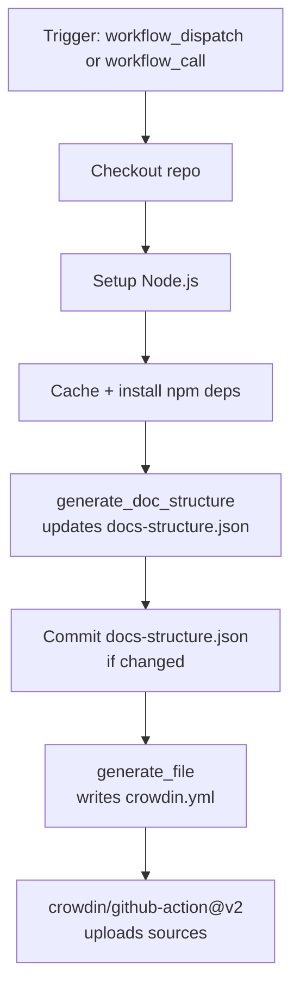
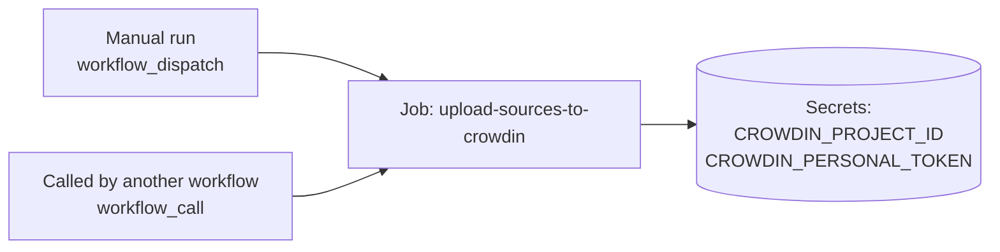
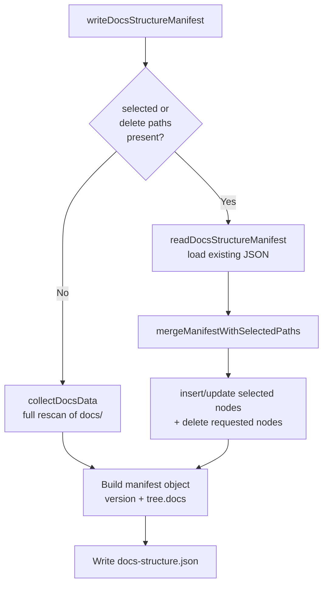
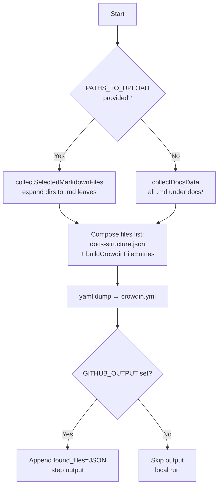
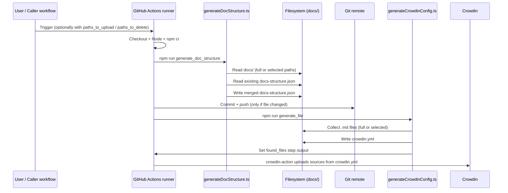

# `upload_sources_to_crowdin` Workflow

This document explains the [.github/workflows/upload_sources_to_crowdin.yml](.github/workflows/upload_sources_to_crowdin.yml) workflow, the scripts it runs, and how data flows between them.

The workflow uploads Markdown source files from `docs/` (plus a `docs-structure.json` manifest) to Crowdin so translators can work on them. It supports both a full upload (every `.md` under `docs/`) and an incremental upload limited to user-selected paths, as well as deletions from the structure manifest.

---

## 1. High-level overview



Two inputs drive the behavior:

- `paths_to_upload` — optional list of docs-relative paths to add/refresh.
- `paths_to_delete` — optional list of docs-relative paths to remove from the manifest.

Both accept comma-separated, newline-separated, or JSON array values (see [`parseRequestedDocsPaths`](src/docsStructure.ts)).

When neither input is provided, both scripts fetch the canonical path list from <https://static-contents.developer.pagopa.it/it/dirNames.json> (the `dirNames` array) via `fetchDirNamesPaths`. That list is the source of truth: `docs-structure.json` is rebuilt from scratch with those paths and the Crowdin upload is scoped to the `.md` files reachable from them. The `docs/` directory is no longer scanned wholesale.

---

## 2. Trigger and inputs



- `workflow_dispatch` lets a maintainer run the workflow from the GitHub UI and optionally fill `paths_to_upload` / `paths_to_delete`.
- `workflow_call` lets other workflows reuse this one and pass the same inputs plus the required Crowdin secrets.
- `permissions: contents: write` is required because the job commits `docs-structure.json` back to the branch.

---

## 3. Step-by-step breakdown

### 3.1 Checkout + Node setup + dependency cache

```yaml
- uses: actions/checkout@v6
- uses: ./.github/actions/setup-node
- uses: actions/cache@v5
  with:
    path: ~/.npm
    key: ${{ runner.os }}-npm-${{ hashFiles('**/package-lock.json') }}
- run: npm ci
```

Standard preparation:

1. Check out the branch that triggered the workflow.
2. Run the local composite action `setup-node` (Node version pinned for the project).
3. Restore the npm cache keyed on `package-lock.json`, so unchanged lockfiles skip a full install.
4. `npm ci` installs the exact dependency tree required by the TypeScript scripts (`ts-node`, `typescript`, `js-yaml`, `@types/*`).

### 3.2 Generate the docs structure manifest

```yaml
- name: Generate docs structure manifest
  env:
    PATHS_TO_UPLOAD: ${{ inputs.paths_to_upload || '' }}
    PATHS_TO_DELETE: ${{ inputs.paths_to_delete || '' }}
  run: npm run generate_doc_structure
```

`npm run generate_doc_structure` is defined in [package.json](package.json#L8-L11) as:

```text
ts-node-script --project tsconfig.json generateDocStructure.ts
```

It runs [generateDocStructure.ts](generateDocStructure.ts), which:

1. Verifies `docs/` exists.
2. Parses `PATHS_TO_UPLOAD` and `PATHS_TO_DELETE` via [`parseRequestedDocsPaths`](docsStructure.ts#L385-L412) (accepts JSON array, CSV, or newline list).
3. Calls [`writeDocsStructureManifest`](docsStructure.ts#L519-L538) with those lists.
4. Logs a summary and exits non-zero on failure.

#### What `writeDocsStructureManifest` does



Key helpers in [docsStructure.ts](docsStructure.ts):

- [`buildDirectoryNode`](docsStructure.ts#L112-L142) — recursively walks a directory and produces a node tree where each entry has a human-readable `label` (dashes/underscores turned into spaces) and a `directory` flag. Markdown filenames are added to a flat `mdFiles` list.
- [`collectDocsData`](docsStructure.ts#L443-L461) — full scan: returns both the manifest and the list of all `.md` paths.
- [`readDocsStructureManifest`](docsStructure.ts#L411-L441) — loads the existing JSON, falling back to an empty root node when the file is missing or malformed.
- [`mergeManifestWithSelectedPaths`](docsStructure.ts#L319-L382) — for each selected path:
  - Normalizes the path, strips a leading `docs/`, rejects empty / ignored (`.gitbook`) entries.
  - Validates the path stays inside `docs/` and points to a `.md` file or a directory.
  - Builds a node from the filesystem ([`createNodeFromSelectedEntry`](docsStructure.ts#L212-L222)) and inserts it into the existing tree via [`insertSelectedNode`](docsStructure.ts#L224-L268), creating missing intermediate directory nodes on the fly and merging children via [`mergeNodes`](docsStructure.ts#L185-L210).
  - For deletions, [`deleteSelectedNode`](docsStructure.ts#L270-L296) walks down the tree and removes the targeted child.
- Finally `JSON.stringify(manifest, null, 2)` is written to `docs-structure.json` with a trailing newline.

#### Manifest shape

```jsonc
{
  "version": 1,
  "tree": {
    "docs": {
      "label": "docs",
      "directory": true,
      "children": {
        "soluzioni": {
          "label": "soluzioni",
          "directory": true,
          "children": {
            "asilo-nido": {
              "label": "asilo nido",
              "directory": true,
              "children": {
                "README.md": { "label": "README", "directory": false }
              }
            }
          }
        }
      }
    }
  }
}
```

### 3.3 Commit the manifest (if changed)

```bash
if [ -n "$(git status --porcelain -- docs-structure.json)" ]; then
  git config user.name  "github-actions[bot]"
  git config user.email "github-actions[bot]@users.noreply.github.com"
  git add docs-structure.json
  git commit -m "chore: update docs structure manifest"
  git push
fi
```

The workflow only commits and pushes when `docs-structure.json` has actually changed, avoiding empty commits. The `contents: write` permission grants the necessary push access.

### 3.4 Generate `crowdin.yml`

```yaml
- name: Generate crowdin file
  id: extract_files
  env:
    PATHS_TO_UPLOAD: ${{ inputs.paths_to_upload || '' }}
  run: npm run generate_file
```

`npm run generate_file` runs [generateCrowdinConfig.ts](generateCrowdinConfig.ts):



Highlights:

- [`collectSelectedMarkdownFiles`](docsStructure.ts#L463-L505) walks each selected path: if it points to a directory it recurses (skipping `.gitbook`), if it points to a `.md` file it just adds it. Paths are normalized so users can pass `docs/foo/bar.md` or `foo/bar.md` interchangeably.
- [`buildCrowdinFileEntries`](docsStructure.ts#L507-L517) maps each source path to a translation path by injecting `%locale%` after `docs/`. The result looks like:

  ```yaml
  - source: docs/soluzioni/asilo-nido/README.md
    translation: docs/%locale%/soluzioni/asilo-nido/README.md
  ```

- An extra entry is prepended unconditionally for the manifest itself:

  ```yaml
  - source: docs-structure.json
    translation: docs/%locale%/_meta/docs-structure.json
  ```

  This is what gives translators access to the readable `label` strings for each folder/file.

- The whole config is serialized with `js-yaml` (`lineWidth: -1` to avoid line wrapping) into [crowdin.yml](crowdin.yml).
- When running on GitHub Actions, the script also appends `found_files=<JSON array>` to `$GITHUB_OUTPUT`, exposing it as `steps.extract_files.outputs.found_files` for downstream steps. Locally that env var is absent and the script just logs an info message.

### 3.5 Upload to Crowdin

```yaml
- uses: crowdin/github-action@v2
  with:
    upload_sources: true
    upload_translations: false
    auto_approve_imported: true
    download_translations: false
    create_pull_request: false
    base_url: 'https://pagopa.crowdin.com'
  env:
    GITHUB_TOKEN: ${{ secrets.GITHUB_TOKEN }}
    CROWDIN_PROJECT_ID: ${{ secrets.CROWDIN_PROJECT_ID }}
    CROWDIN_PERSONAL_TOKEN: ${{ secrets.CROWDIN_PERSONAL_TOKEN }}
```

The official Crowdin action reads the freshly generated `crowdin.yml` and:

- Uploads every file listed under `files:` as a source string set.
- Auto-approves imported strings so existing translations get reused immediately.
- Does **not** download translations, open PRs, or push translations back in this workflow — that responsibility lives in a separate workflow.
- Authenticates against the PagoPA Crowdin instance using the two repository secrets.

---

## 4. End-to-end data flow



---

## 5. Reference

| Concern | Location |
| --- | --- |
| Workflow definition | [.github/workflows/upload_sources_to_crowdin.yml](.github/workflows/upload_sources_to_crowdin.yml) |
| Manifest entry point | [generateDocStructure.ts](generateDocStructure.ts) |
| Crowdin config entry point | [generateCrowdinConfig.ts](generateCrowdinConfig.ts) |
| Shared helpers (tree walk, merge, parsing) | [docsStructure.ts](docsStructure.ts) |
| Generated manifest | `docs-structure.json` |
| Generated Crowdin config | [crowdin.yml](crowdin.yml) |
| npm scripts | [package.json](package.json#L8-L11) |
